# Práctica 1
## Bases de Datos 2

Desarrollado por: 

Asunción Mariana Sic Sor **_201504051_**

## Tabla de Contenido

* [Permisos y Autenticación](#permisos-y-autenticación)
    * [Configuración inicial](#configuración-inicial)
    * [Configuración de Roles](#roles)
    * [Configuración de Usuarios](#usuarios)
    * [Vista](#vista)
* [Backup](#backup)
* [Referencias](#referencias)

# Permisos y Autenticación
## Configuración Inicial
### TableSpace

Para crear el tablespace, se requiere lo siguiente

|Propiedad|Nombre|
|:--:|:--:|
|TableSpace|ELECCIONESTBS|
|DataFile|ELECCIONESDTF.tbs|
|Tamaño DataFile|250MB ~ 500MB|

Se creó de la siguiente manera:
```sql
create tablespace ELECCIONESTBS
datafile 'ELECCIONESDTF.tbs'
size 250M
autoextend on maxsize 500M;
```

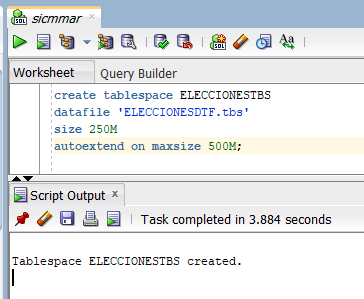

### Schema

El nombre del schema será ```ELECCIONES``` asignando el tablespace creado [anteriormente](#tablespace).

Para esto, se crea de la siguiente manera:
```sql
create user elecciones identified by elecciones
default tablespace ELECCIONESTBS;

grant all privileges to ELECCIONES;
```
Se ejecuta y se crea con éxito

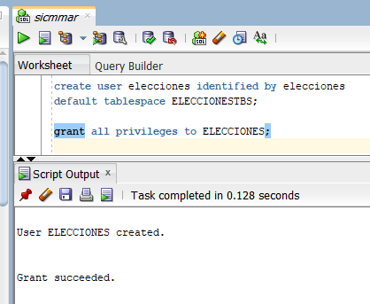

### Parámetros Iniciales

Parámetros requeridos
|Parámetro|Tamaño|
|:--:|:--:|
|SGA|500MB|
|Processes|1500|
|Sessions|500|
|PGA|100MB|

#### SGA

Es un parámetro modificable que configura el tamaño de la memoria SGA.

Se cambia de la siguiente manera
```sql
alter system set sga_target=500M;
show parameter sga_target;
```

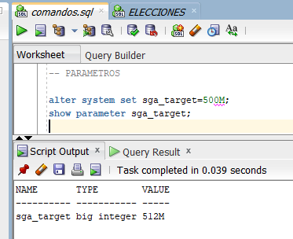

Pero al momento de cambiar el valor de la memoria SGA ocurre el siguiente error

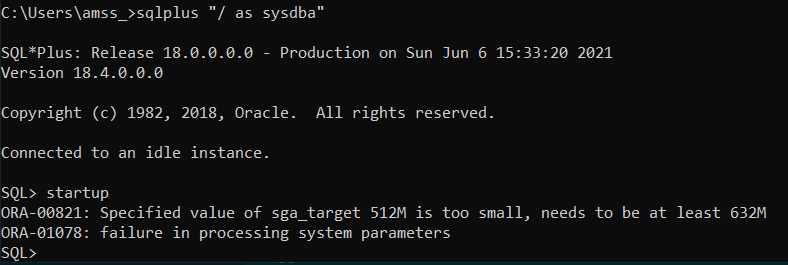

Por esta razón, se extiende la memoria a 700 MB 

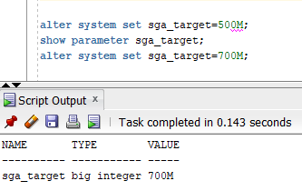

#### Processes

Este parámetro modifica la cantidad máxima de procesos admitidos que el usuario puede realizar mientras utiliza Oracle en el Sistema Operativo anfitrión, por lo tanto dependerá del número de cores que contiene la máquina y por esa razón no se puede modificar el número [[1]](#1)

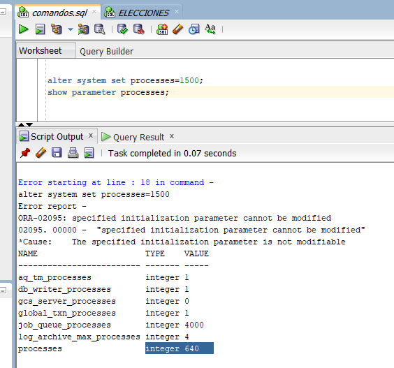

#### Sessions


#### PGA
Se modifica de la siguiente manera 
```sql
alter system set pga_aggregate_target=100M;
show parameter pga;
```
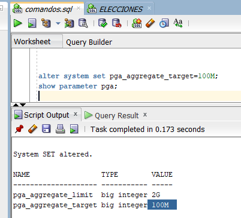

## Roles

Se ha creado un rol para cada instrucción de SQL en las tablas de la base de datos para facilitar más adelante dar permisos a los diferentes roles solicitados de la siguiente manera

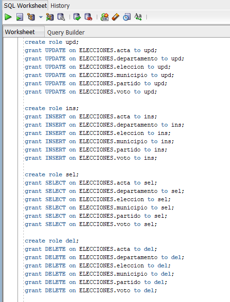

Los roles solicitados son los siguientes

|Área|Update|Insert|Select|Delete|Crear Usuarios|Crear Tablas|
|:--:|:--:|:--:|:--:|:--:|:--:|:--:|
|Guest|||x||||
|Mesas||x|x||||
|IT|||x||x|x|
|Admin|x|x|x|x|x||

De tal manera que se crean de la siguiente manera

```sql
create role guest;
grant sel to guest;

create role mesas;
grant ins, sel to mesas;

create role it;
grant sel, create user, create table to it;

create role admin;
grant upd, ins, sel, del, create user to admin;
```

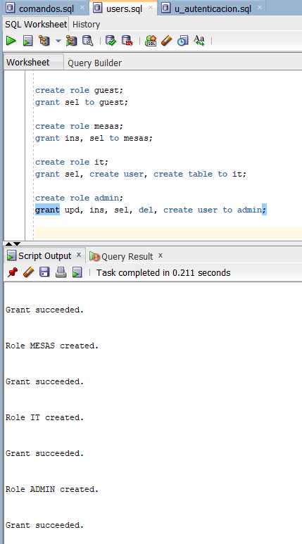

## Usuarios

Para crear un usuario, se siguen los siguientes comandos

```sql
create user guest1 identified by guest1
default tablespace ELECCIONESTBS;
```

Y luego para otorgar permisos a cada usuario, se concede según al rol al que pertenezca con los roles previamente creados

```sql
grant guest to guest1;
```

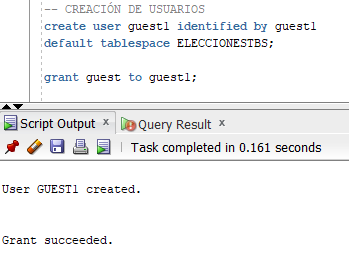

Este procedimiento se sigue para cada usuario solicitado, éstos son:
<table>
    <tr>
        <td>Rol</td>
        <td>Usuario/Contraseña</td>
    <tr>
    <tr>
        <td rowspan="4" >Guest</td>
        <td>guest1/guest1</td>
    <tr>
    <tr>
        <td>guest2/guest2</td>
    </tr>
    <tr>
        <td>guest3/guest3</td>
    </tr>
    <tr>
        <td rowspan="4" >Mesas</td>
        <td>mesas1/mesas1</td>
    </tr>
    <tr>
        <td>mesas2/mesas2</td>
    </tr>
    <tr>
        <td>mesas3/mesas3</td>
    </tr>
    <tr>
        <td>mesas4/mesas4</td>
    </tr>
    <tr>
        <td rowspan="3" >IT</td>
        <td>it1/it1</td>
    </tr>
    <tr>
        <td>it2/it2</td>
    </tr>
    <tr>
        <td>it3/it3</td>
    </tr>
    <tr>
        <td rowspan="2" >Admin</td>
        <td>admin1/admin1</td>
    </tr>
    <tr>
        <td>admin2/admin2</td>
    </tr>
</table>

Para comprobar que los usuarios fueron creados éxitosamente, se corre la siguiente pequeña consulta

```sql
SELECT username, created FROM all_users where created > '01-JUN-21';
```

La cual arroja el siguiente resultado

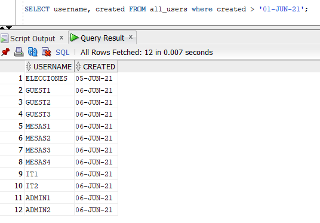

## Vista

Primero se realiza la consulta para verificar que sea respecto a los datos requeridos.

Los datos requeridos son 

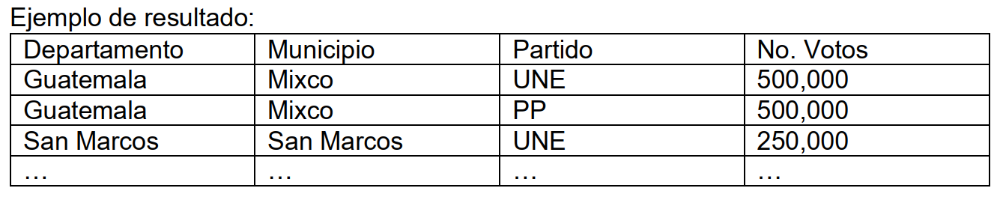

La consulta creada para esto, es

```sql
select dep.nombre_depto as departamento, mun.nombre_muni as municipio, 
par.nombre_part as partido, a.total_votos_validos
from ELECCIONES.departamento dep, ELECCIONES.municipio mun, ELECCIONES.acta a
inner join ELECCIONES.voto v on a.numero_mesa = v.voto_mesa 
inner join ELECCIONES.partido par on v.voto_partido = par.codigo_part
where a.departamento = dep.codigo_depto and a.municipio = mun.codigo_muni 
order by a.total_votos_validos desc
```

Y los datos resultantes son

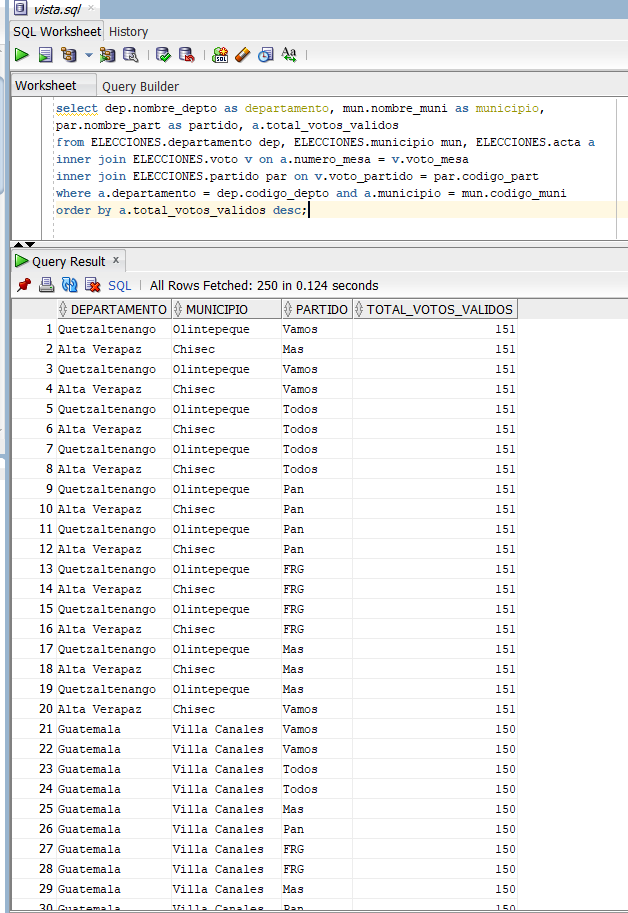

Luego se crea la vista con

```sql
create view VOTOSPRESIDENTE
as
(select dep.nombre_depto as departamento, mun.nombre_muni as municipio, 
par.nombre_part as partido, a.total_votos_validos
from ELECCIONES.departamento dep, ELECCIONES.municipio mun, ELECCIONES.acta a
inner join ELECCIONES.voto v on a.numero_mesa = v.voto_mesa 
inner join ELECCIONES.partido par on v.voto_partido = par.codigo_part
where a.departamento = dep.codigo_depto and a.municipio = mun.codigo_muni);
```

Finalmente, se garantiza el permiso al usuario ```guest1```

```sql
grant select on VOTOSPRESIDENTE to guest1;
```

# Backup

# Referencias
## 1 
Oracle (2019). Database Reference: 1.266 PROCESSES Junio 5, 2021, de Oracle Sitio web: [https://docs.oracle.com/en/database/oracle/oracle-database/18/refrn/PROCESSES.html#GUID-B757AF80-DA38-4167-A914-FE376A3AD4FE](https://docs.oracle.com/en/database/oracle/oracle-database/18/refrn/PROCESSES.html#GUID-B757AF80-DA38-4167-A914-FE376A3AD4FE)
